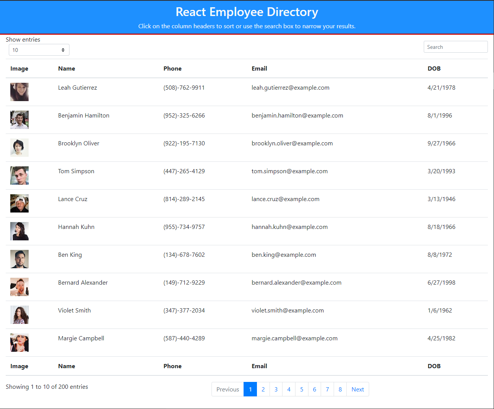
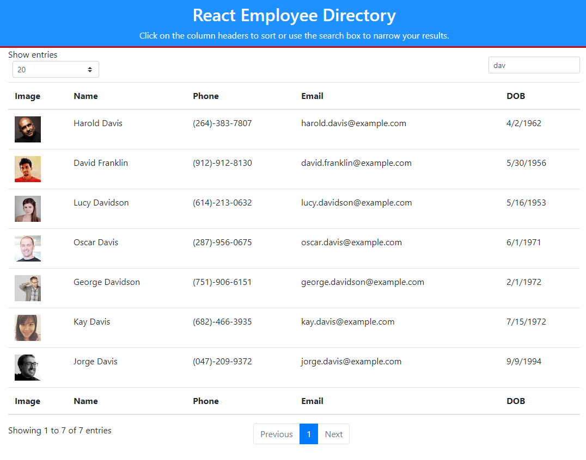

# React-Employee-Directory
This is all my employee directory using ReactJS, Axios, Boostrap, and MDB React for the datatables. This app is deployed to Github Pages and the link is provided below. 

License: 

## Description 

This application is built from create-react-app built from the ground up. This application is to demonstrate the magical thing that is called ReactJS. In this application, you will be looking at a table of random employees from [Random User API](https://randomuser.me/). This application demonstrate the use of components, manage component state, and responding to user events. 

Screenshots:

## Table of Contents

* [Installation](#installation)
* [Usage](#usage)
* [License](#license)
* [Contributing](#contributing)
* [Tests](#tests)
* [Questions](#questions)

## Installation

You can use the deployed application at the link below. 

## Usage 

Here are some features of this application. 

  - user can sort the name, phone email, or date of birth by clicking on the column header
  - user can search for specific employees with search function
  - user can limit how many employees to show on the page at once
  - employee table has pagination to load the employees by page

Deployed: https://code-monkey713.github.io/react-employee-directory/

## License

MIT

## Contributing

If you would like to contribute to this project, you can fork a copy of the repo and make changes or improvements on your repo. Once ready, you can request a push and I will review the changes before updating the repo. 

## Tests

There are no tests with this application. Let me know if you are interested in creating a test for this application. 

## Questions

If you have any questions, feel free to contact me and listed below are my contact informations. 

GitHub profile: code-monkey713

Email: codemonkey713@gmail.com